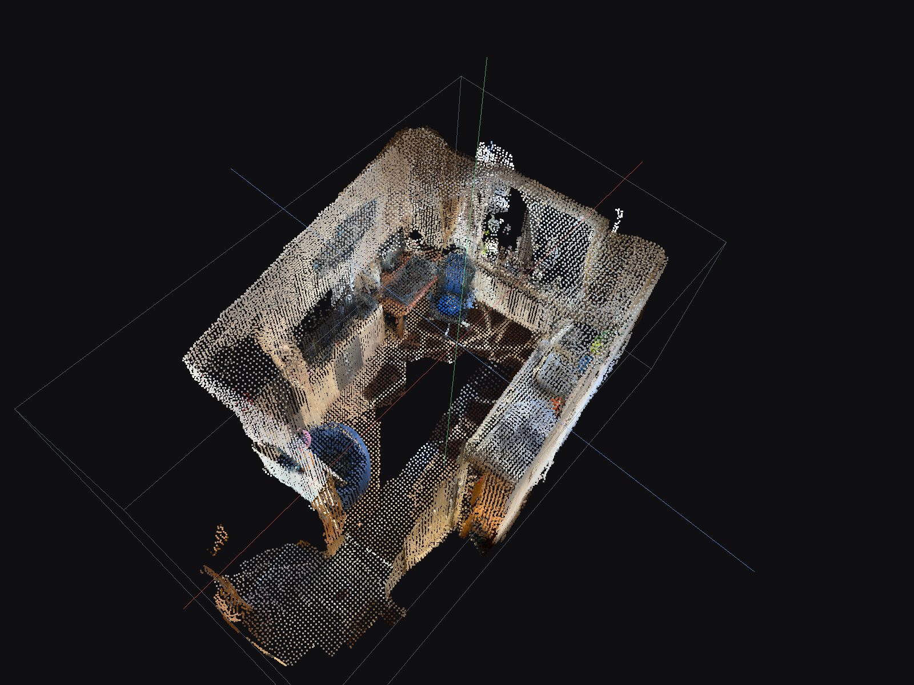
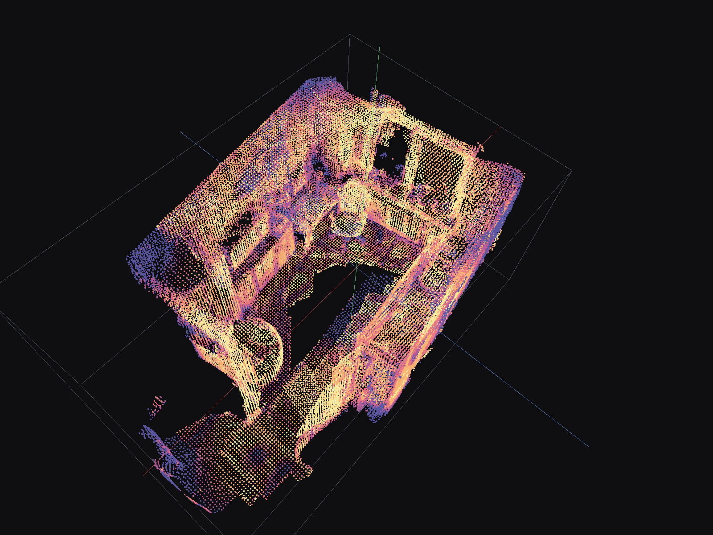
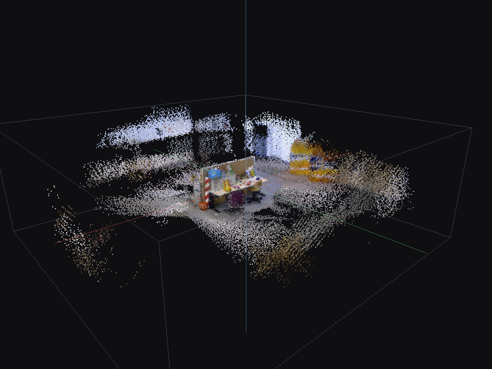
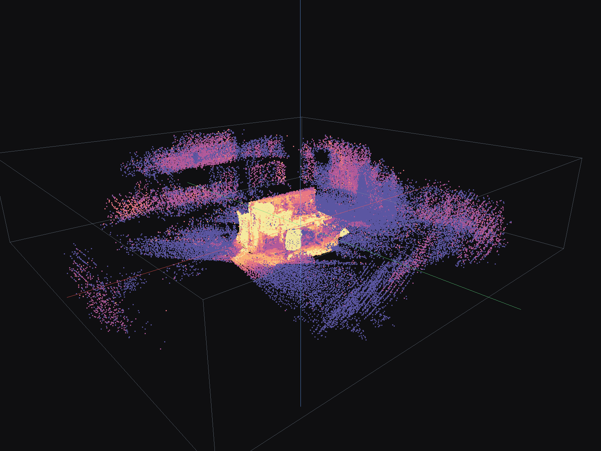
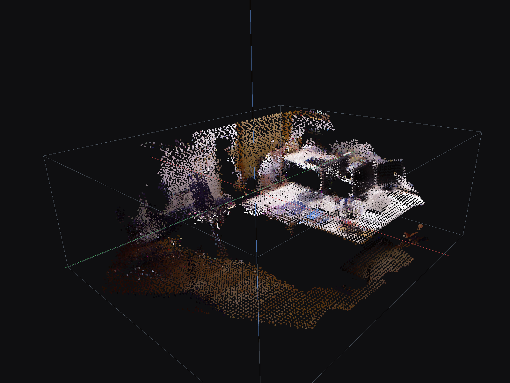
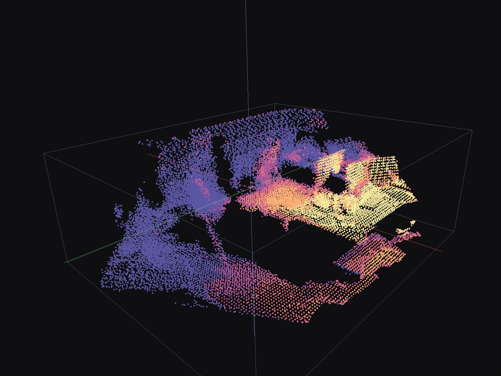
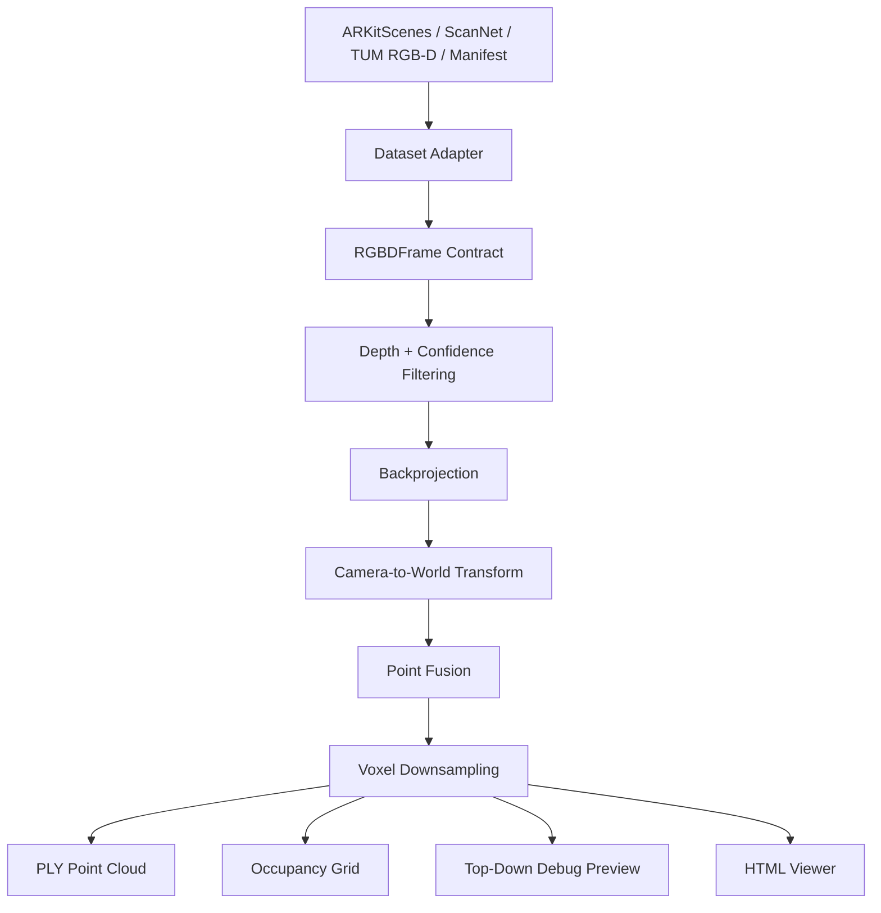
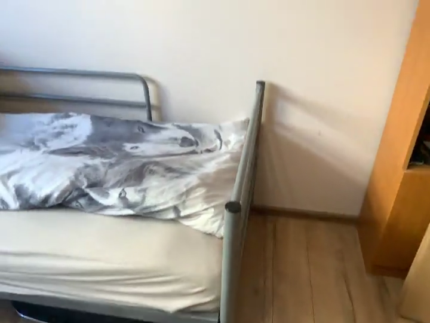

# 3DScape

**3DScape is an experiment in making 3D room scans inspectable. It reconstructs rooms from color-plus-depth camera data, learns & visualizes which parts of the geometry are likely stable or noisy, and exports a custom HTML viewer for exploring each scan in the browser.**

Some cameras capture both color and pixel depth - 3DScape takes those color-plus-depth frames, along with the camera position for each frame, and fuses them into an interactive 3D room scan. When developing 3D perception systems, it's very important that we can visually inspect their outputs to understand where geometry may be unreliable. This experiment combines a classical geometry pipeline with a small learned reliability layer to make that uncertainty visible.

The project combines two deliberately separated pieces:

1. a deterministic geometry pipeline that fuses RGB-D frames into a colored 3D point cloud
2. a small PyTorch Reliability Net that estimates which depth observations are likely to be stable or noisy

3DScape uses **posed RGB-D** input: RGB images, depth maps, camera intrinsics, and camera poses.

```text
Color & depth frames -> camera geometry -> fused 3D point cloud -> browser viewer
```

## Highlights

- Multi-dataset RGB-D reconstruction for ARKitScenes, TUM RGB-D, ScanNet-style folders, and generic manifests.
- Shared `RGBDFrame` interface for RGB, depth, confidence, intrinsics, camera pose, timestamp, and depth scale.
- Deterministic metric point-cloud fusion from posed RGB-D frames.
- Reproducible artifacts: occupancy grids, run manifests, top-down debug previews, and standalone HTML viewers.
- Reference-mesh evaluation on ARKitScenes, including median and p90 reconstruction distances plus mesh coverage.
- Optional PyTorch Reliability Net experiment for per-pixel depth reliability diagnostics.

## Demo Preview

These static previews are generated from the same embedded point data and default viewpoint used by the interactive viewers.

The viewer is looking at a fused point cloud: each visible dot is a 3D point created by taking a valid depth pixel from one frame, backprojecting it through the camera intrinsics, transforming it into a shared world coordinate system using the camera pose, and merging it with points from other frames. The boxes and axes are viewer guides for orientation.


| Viewer type | What the colors mean |
| --- | --- |
| RGB-D fusion | Points are colored from the source RGB frames, so walls, furniture, and objects keep their image color. |
| Reliability diagnostic | Points are colored by estimated depth reliability, not object class or semantic meaning. |

Reliability Outputs:

| ARKitScenes RGB-D | ARKitScenes reliability |
| --- | --- |
|  |  |

| TUM freiburg3 RGB-D | TUM freiburg3 reliability |
| --- | --- |
|  |  |

| TUM freiburg1 RGB-D | TUM freiburg1 reliability |
| --- | --- |
|  |  |

Color key:

| Color | Meaning |
| --- | --- |
|  | Highest reliability; most trusted local surface evidence |
|  | High reliability; generally stable depth |
|  | Medium reliability; usable but less certain geometry |
|  | Low reliability; possible edge, occlusion, or noise artifacts |
|  | Lowest reliability; least trusted depth observations |

## Results

ARKitScenes reconstructions were compared against provided reference meshes using approximate nearest-neighbor vertex distances.

| Run | Points | source->mesh median | source->mesh p90 | mesh coverage | mesh->source p90 |
| --- | ---: | ---: | ---: | ---: | ---: |
| ARKitScenes 47333462 classical RGB-D fusion | 62,953 | 0.0186 m | 0.0432 m | 95.03% | 0.0567 m |
| ARKitScenes 47333462 Reliability Net soft fusion | 61,468 | 0.0192 m | 0.0441 m | 95.02% | 0.0579 m |

The classical RGB-D fusion baseline is currently the strongest reconstruction path. The learned reliability path performs similarly, but does not yet improve reconstruction quality in this evaluation.

## What It Does

3DScape reconstructs indoor geometry from RGB-D sequences with known depth, camera intrinsics, and camera poses. Each frame can include:

- an RGB image
- a depth map
- camera intrinsics
- a camera pose
- an optional confidence map
- timestamp and depth-scale metadata

For each frame, the pipeline:

1. Loads dataset-specific RGB-D data through an adapter.
2. Converts it into a shared `RGBDFrame` contract.
3. Filters depth using validity and confidence rules.
4. Backprojects depth pixels into 3D camera-space points.
5. Transforms points into a shared world coordinate system using the camera pose.
6. Fuses points across frames.
7. Downsamples the fused cloud.
8. Exports point clouds, occupancy previews, run manifests, and browser viewers.

This is not a raw monocular video reconstruction system. It assumes posed RGB-D input, meaning depth and camera pose must already be available from the dataset, sensor, or an upstream SLAM / pose-estimation system.

## How It Works



Each `RGBDFrame` contains:

```text
rgb_path
depth_path
confidence_path
intrinsics
pose
timestamp
depth_scale_m
name
```

## Supported Inputs

| Input | Status | Notes |
| --- | --- | --- |
| ARKitScenes | Implemented | RGB-D frames, intrinsics, poses, confidence maps, optional reference mesh |
| TUM RGB-D | Implemented | RGB/depth images plus ground-truth trajectory text files |
| ScanNet-style folders | Implemented | Standard color/depth/pose/intrinsic folder layout |
| Generic manifest | Implemented | Dataset-agnostic JSON path for any posed RGB-D source |
| Raw `.MOV` video | Not implemented | Requires pose/depth estimation or SLAM before fusion |

## Quick Start

Create a virtual environment, install the package, and run the dependency check.

```bash
python3 -m venv .venv
source .venv/bin/activate
python3 -m pip install -e ".[dev]"
python3 scripts/doctor.py
```

Optional ML dependencies:

```bash
python3 -m pip install -e ".[dev,ml]"
```

## Running Reconstructions

### ARKitScenes

```bash
python3 scripts/reconstruct_scan.py \
  --dataset arkitscenes \
  --scan-dir /path/to/arkitscenes_data/raw/Training/47333462 \
  --rgb-dir /path/to/arkitscenes_data/raw/Training/47333462/lowres_wide \
  --out-dir workspaces/arkitscenes_47333462_rgbd \
  --max-frames 120 \
  --target-fps 4 \
  --pixel-stride 2 \
  --min-confidence 2
```

### TUM RGB-D

```bash
python3 scripts/reconstruct_scan.py \
  --dataset tum_rgbd \
  --scan-dir /path/to/rgbd_dataset_freiburg1_xyz \
  --out-dir workspaces/tum_freiburg1_xyz_rgbd \
  --max-frames 120 \
  --target-fps 4 \
  --pixel-stride 2 \
  --tum-intrinsics auto
```

### Generic Manifest

```bash
python3 scripts/reconstruct_scan.py \
  --dataset manifest \
  --scan-dir path/to/manifest.json \
  --out-dir workspaces/my_manifest_scan \
  --max-frames 120 \
  --target-fps 4 \
  --pixel-stride 2
```

### Generate an HTML Viewer

```bash
python3 scripts/make_pointcloud_viewer.py \
  --ply workspaces/arkitscenes_47333462_rgbd/arkitscenes_rgbd_downsampled_metric.ply \
  --out-html workspaces/arkitscenes_47333462_rgbd/pointcloud_viewer.html \
  --axis-map x,-z,y \
  --default-rotation-deg -150 0 27
```

### Compare Against a Reference Mesh

If a reference mesh is available, use:

```bash
python3 scripts/compare_to_reference_mesh.py \
  --source-ply workspaces/arkitscenes_47333462_rgbd/arkitscenes_rgbd_downsampled_metric.ply \
  --reference-ply /path/to/47333462_3dod_mesh.ply \
  --out-dir workspaces/arkitscenes_47333462_mesh_compare
```

## Outputs

| Output | Description |
| --- | --- |
| `*_raw_metric.ply` | Colored fused point cloud before final downsampling |
| `*_downsampled_metric.ply` | Smaller colored point cloud for inspection and sharing |
| `*_occupied_only.npz` | Occupied-surface voxel grid |
| `*_manifest.json` | Run manifest with inputs, parameters, and output paths |
| `pointcloud_viewer.html` | Standalone browser viewer with embedded point data |

## Demo Viewers

The public demo page is hosted with GitHub Pages:

- [https://rcprobe.github.io/3DScape/](https://rcprobe.github.io/3DScape/)

GitHub's normal repository browser displays committed HTML files as source text. Use the Pages link above, or run a local static server from the repository root.

```bash
python3 -m http.server 8000
```

Then open:

- Demo landing page: [http://localhost:8000/](http://localhost:8000/)
- ARKitScenes viewer: [http://localhost:8000/demos/arkitscenes_47333462_viewer.html](http://localhost:8000/demos/arkitscenes_47333462_viewer.html)
- ARKitScenes reliability viewer: [http://localhost:8000/demos/arkitscenes_47333462_reliability_viewer.html](http://localhost:8000/demos/arkitscenes_47333462_reliability_viewer.html)

The landing page links to the additional TUM RGB-D viewers.

### Source Video Preview

This web-compressed full-length preview is from ARKitScenes scan `47333462`, the sequence used for the ARKitScenes reconstruction demo. The full raw `.mov` is not committed because it is roughly 503 MB.

[](docs/assets/arkitscenes_47333462_preview.mp4)

Click the thumbnail to open the source-video preview. The Pages demo renders this same preview as an inline playable video.

## Experimental: Reliability Net

3DScape includes an optional learned reliability module for estimating which valid-looking depth observations are likely to be geometrically unstable.

The Reliability Net is a small PyTorch U-Net-style model that predicts a per-pixel reliability score from:

```text
RGB
normalized depth
valid-depth mask
depth gradient x
depth gradient y
```

Reliability scores can be used as:

1. soft fusion weights during point-cloud construction
2. diagnostic colors in reliability-colored point-cloud viewers

The Reliability Net is included as an experimental uncertainty-estimation layer. In the current ARKitScenes comparison, it performs similarly to the classical fusion path but does not improve reconstruction quality. It remains separate from the deterministic geometry pipeline so the learned component can be evaluated without obscuring the baseline.

## Design Notes

- **Dataset adapters:** Each dataset parser emits the same `RGBDFrame` structure, keeping dataset-specific parsing separate from geometry logic.
- **Deterministic fusion baseline:** The core reconstruction path uses camera geometry instead of an end-to-end learned model, making failures easier to inspect and debug.
- **Focused ML layer:** Reliability Net estimates depth-observation reliability without replacing pose, projection, or fusion logic.

## Limitations

- Requires posed RGB-D input; it does not estimate camera motion or reconstruct arbitrary monocular video.
- Occupancy outputs currently represent observed occupied surfaces only, not full free-space reasoning.
- Dynamic objects are handled only through basic depth, confidence, and reliability filtering.
- Reliability Net is experimental and currently does not improve on the classical fusion baseline.

## Project Structure

```text
3DScape/
  README.md
  DATASETS.md
  pyproject.toml
  docs/
    index.html
    ATTRIBUTION.md
    assets/
    demos/
  scripts/
    reconstruct_scan.py
    reconstruct_arkitscenes_rgbd.py
    make_pointcloud_viewer.py
    compare_to_reference_mesh.py
    build_reliability_dataset.py
    train_reliability.py
    report_reliability_tradeoff.py
    doctor.py
  src/
    scapev3/
      arkitscenes.py
      scannet.py
      tum_rgbd.py
      manifest_rgbd.py
      voxel.py
      ply.py
      compare.py
      cli.py
      learned/
        reliability.py
  tests/
```

## Tests

```bash
python3 -m pytest -q
python3 -m ruff check .
```

## Future Work

- Add a stronger Reliability Net evaluation suite with AUROC, calibration, and risk-coverage curves.
- Add optional TSDF or ray-carving fusion for free-space reasoning.
- Add a pose-estimation front end for phone-video experiments.
