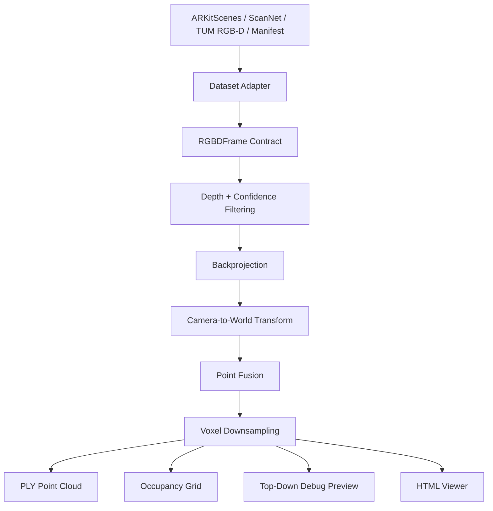

# 3DScape (Experiment & MVP)

**A lightweight RGB-D fusion pipeline for turning posed indoor depth frames into metric point clouds, occupancy previews, and browser-based scan viewers.**

> RGB-D Dataset -> Dataset Adapter -> Backproject Depth -> Align With Camera Pose -> Fuse Points -> Export + Inspect

This project does RGB-D reconstruction, fusing RGB frames that have depth, camera intrinsics, and camera poses. It's an Indoor 3D reconstruction pipeline - these often depend on dataset-specific formats, camera geometry, large generated artifacts, etc., but my project implements an **RGB-D reconstruction MVP** that:

1. Normalizes multiple posed RGB-D dataset formats into one frame contract.
2. Backprojects depth pixels into 3D camera-space points.
3. Transforms each frame into a shared world coordinate system.
4. Fuses and downsamples points into a colored room-scale point cloud.
5. Exports reproducible artifacts for inspection and evaluation.

## Demo Preview

These static previews are generated from the same embedded point data and default viewpoint used by the interactive viewers.

| ARKitScenes RGB-D | ARKitScenes reliability |
| --- | --- |
|  |  |

| TUM freiburg3 RGB-D | TUM freiburg3 reliability |
| --- | --- |
|  |  |

| TUM freiburg1 RGB-D | TUM freiburg1 reliability |
| --- | --- |
|  |  |

GitHub's normal repository browser displays committed HTML files as source text. Run the local static server below to open the viewers directly. Public web links require GitHub Pages to be enabled from the repo settings.

## Demo Links

These links work after running the local demo server:

| Link | Title |
| --- | --- |
| [http://localhost:8000/](http://localhost:8000/) | Demo landing page |
| [http://localhost:8000/demos/arkitscenes_47333462_viewer.html](http://localhost:8000/demos/arkitscenes_47333462_viewer.html) | ARKitScenes 47333462 RGB-D fusion viewer |
| [http://localhost:8000/demos/arkitscenes_47333462_reliability_viewer.html](http://localhost:8000/demos/arkitscenes_47333462_reliability_viewer.html) | ARKitScenes 47333462 reliability diagnostic viewer |
| [http://localhost:8000/demos/tum_freiburg1_xyz_viewer.html](http://localhost:8000/demos/tum_freiburg1_xyz_viewer.html) | TUM freiburg1_xyz RGB-D fusion viewer |
| [http://localhost:8000/demos/tum_freiburg1_xyz_reliability_viewer.html](http://localhost:8000/demos/tum_freiburg1_xyz_reliability_viewer.html) | TUM freiburg1_xyz reliability diagnostic viewer |
| [http://localhost:8000/demos/tum_freiburg3_long_office_household_viewer.html](http://localhost:8000/demos/tum_freiburg3_long_office_household_viewer.html) | TUM freiburg3 long office household RGB-D fusion viewer |
| [http://localhost:8000/demos/tum_freiburg3_long_office_household_reliability_viewer.html](http://localhost:8000/demos/tum_freiburg3_long_office_household_reliability_viewer.html) | TUM freiburg3 long office household reliability diagnostic viewer |

## Reference Inputs

This compressed preview is from ARKitScenes scan `47333462`, the sequence used for the ARKitScenes reconstruction demo. The full raw `.mov` is not committed because it is roughly 503 MB.

[](docs/assets/arkitscenes_47333462_preview.mp4)

Click the thumbnail to open the compressed source-video preview. The Pages demo renders this same preview as an inline playable video.


## Pipeline Overview


Each `RGBDFrame` object contains:

```text
rgb_path
depth_path
confidence_path
intrinsics
pose
timestamp
depth_scale_m
name
```

## Project Structure

```text
3DScapeV4/
  README.md
  DATASETS.md
  pyproject.toml
  docs/
    index.html
    ATTRIBUTION.md
    assets/
    demos/
  scripts/
    reconstruct_scan.py
    reconstruct_arkitscenes_rgbd.py
    make_pointcloud_viewer.py
    compare_to_reference_mesh.py
    build_reliability_dataset.py
    train_reliability.py
    report_reliability_tradeoff.py
    doctor.py
  src/
    scapev3/
      arkitscenes.py
      scannet.py
      tum_rgbd.py
      manifest_rgbd.py
      rgbd.py
      voxel.py
      ply.py
      compare.py
      cli.py
      learned/
        reliability.py
  tests/
```

## Quick Start

1. Create a virtual environment.
2. Install the package.
3. Run the dependency check.
4. Reconstruct a supported RGB-D scan.
5. Generate an HTML point-cloud viewer.

```bash
python3 -m venv .venv
source .venv/bin/activate
python3 -m pip install -e ".[dev]"
python3 scripts/doctor.py
```

Optional ML dependencies:

```bash
python3 -m pip install -e ".[dev,ml]"
```

## Supported Inputs

| Input | Status | Notes |
| --- | --- | --- |
| ARKitScenes | Implemented | RGB-D frames, intrinsics, poses, confidence maps, optional reference mesh |
| TUM RGB-D | Implemented | RGB/depth images plus ground-truth trajectory text files |
| ScanNet-style folders | Implemented | Standard color/depth/pose/intrinsic folder layout |
| Generic manifest | Implemented | Dataset-agnostic JSON path for any posed RGB-D source |
| Raw `.MOV` video | Not implemented | Requires pose/depth estimation or SLAM before fusion |

## Commands

Run ARKitScenes reconstruction:

```bash
python3 scripts/reconstruct_scan.py \
  --dataset arkitscenes \
  --scan-dir /path/to/arkitscenes_data/raw/Training/47333462 \
  --rgb-dir /path/to/arkitscenes_data/raw/Training/47333462/lowres_wide \
  --out-dir workspaces/arkitscenes_47333462_rgbd \
  --max-frames 120 \
  --target-fps 4 \
  --pixel-stride 2 \
  --min-confidence 2
```

Run TUM RGB-D reconstruction:

```bash
python3 scripts/reconstruct_scan.py \
  --dataset tum_rgbd \
  --scan-dir /path/to/rgbd_dataset_freiburg1_xyz \
  --out-dir workspaces/tum_freiburg1_xyz_rgbd \
  --max-frames 120 \
  --target-fps 4 \
  --pixel-stride 2 \
  --tum-intrinsics auto
```

Run a generic manifest:

```bash
python3 scripts/reconstruct_scan.py \
  --dataset manifest \
  --scan-dir path/to/manifest.json \
  --out-dir workspaces/my_manifest_scan \
  --max-frames 120 \
  --target-fps 4 \
  --pixel-stride 2
```

Generate an HTML viewer:

```bash
python3 scripts/make_pointcloud_viewer.py \
  --ply workspaces/arkitscenes_47333462_rgbd/arkitscenes_rgbd_downsampled_metric.ply \
  --out-html workspaces/arkitscenes_47333462_rgbd/pointcloud_viewer.html \
  --axis-map x,-z,y \
  --default-rotation-deg -150 0 27
```

Compare against a reference mesh (if you have one):

```bash
python3 scripts/compare_to_reference_mesh.py \
  --source-ply workspaces/arkitscenes_47333462_rgbd/arkitscenes_rgbd_downsampled_metric.ply \
  --reference-ply /path/to/47333462_3dod_mesh.ply \
  --out-dir workspaces/arkitscenes_47333462_mesh_compare
```

## Outputs

| Output | Description |
| --- | --- |
| `*_raw_metric.ply` | Colored fused point cloud before final downsampling |
| `*_downsampled_metric.ply` | Smaller colored point cloud for inspection and sharing |
| `*_occupied_only.npz` | Occupied-surface voxel grid |
| `*_top_down.png` | Optional 2D overhead density sanity check, not the main visual output |
| `*_manifest.json` | Run manifest with inputs, parameters, and output paths |
| `pointcloud_viewer.html` | Standalone browser viewer with embedded point data |

## Current Metrics

ARKitScenes reconstructions were compared against provided reference meshes using approximate nearest-neighbor vertex distances.

| Run | Points | source->mesh median | source->mesh p90 | mesh coverage | mesh->source p90 |
| --- | ---: | ---: | ---: | ---: | ---: |
| ARKitScenes 47333462 classical RGB-D fusion | 62,953 | 0.0186 m | 0.0432 m | 95.03% | 0.0567 m |
| ARKitScenes 47333462 Reliability Net soft fusion | 61,468 | 0.0192 m | 0.0441 m | 95.02% | 0.0579 m |

The learned reliability path is currently a diagnostic experiment, not a proven reconstruction-quality improvement.

## Reliability Net

The optional Reliability Net is a small PyTorch U-Net-style module that predicts a per-pixel reliability score from:

```text
RGB
normalized depth
valid-depth mask
depth gradient x
depth gradient y
```

The model is intended to answer:

```text
Which valid-looking depth observations are likely to be geometrically unstable?
```

Reliability scores can be used as soft fusion weights and as colors in diagnostic point-cloud viewers. The current result is frankly limited: the module is wired into the pipeline and evaluable, but it does not yet beat the classical fusion baseline.

## Design Choices

### Dataset Adapters

Each dataset has its own parser, but all adapters emit the same `RGBDFrame` structure.

**Pros**

- Keeps dataset-specific file parsing separate from geometry logic
- Makes ScanNet, TUM, ARKitScenes, and generic manifests share the same fusion engine
- Makes new dataset support easier to add

**Tradeoffs**

- Each adapter still needs careful timestamp, pose, intrinsics, and depth-scale handling
- Bad adapter assumptions can corrupt the reconstruction

### Classical RGB-D Fusion

The core reconstruction path uses deterministic geometry rather than an end-to-end learned model.

**Pros**

- Easy to inspect and debug
- Works without training
- Makes failure modes easier to explain

**Tradeoffs**

- Does not infer missing geometry
- Does not solve raw video reconstruction

### U-Net for Reliability Net

The learned module is intentionally small: a PyTorch U-Net-style reliability predictor that scores each valid depth pixel before fusion. It does not replace camera geometry. Instead, it estimates which local RGB-D observations are likely to be stable enough to trust.

**Pros**

- Adds a focused ML component where learning is useful: uncertainty estimation
- Keeps the core metric reconstruction path deterministic and debuggable
- Produces reliability-colored viewers for inspecting likely noisy geometry

**Tradeoffs**

- It is not an end-to-end reconstruction model
- It needs stronger training and evaluation before claiming quality gains

## Limitations

- Requires RGB-D frames with camera poses.
- Does not reconstruct arbitrary `.MOV` files.
- Does not estimate camera motion from RGB video.
- Occupancy is occupied-surface only; free vs unknown space is not modeled.
- Dynamic objects are handled only through basic depth/confidence/reliability filtering.
- Reference-mesh evaluation uses approximate nearest-neighbor distances.
- Reliability Net is experimental and currently underperforms the classical baseline on the ARKit mesh comparison.

## Tests

```bash
python3 -m pytest -q
python3 -m ruff check .
```

## Future Work

- Add a stronger Reliability Net evaluation suite with AUROC, calibration, and risk-coverage curves
- Add optional TSDF or ray-carving fusion for free-space reasoning
- Add a pose-estimation front end for phone-video experiments
