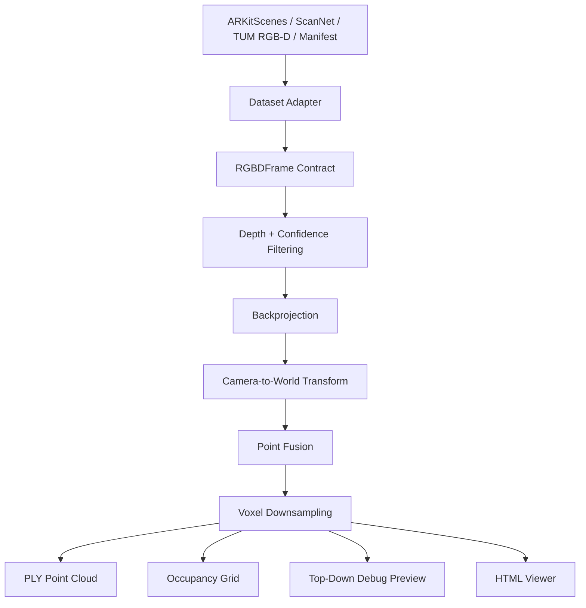

# 3DScape

**3DScape is a lightweight RGB-D reconstruction pipeline for turning posed indoor RGB-D frames into metric colored point clouds, occupancy previews, and browser-based scan viewers.**

It supports multiple RGB-D dataset formats through a shared frame contract, then uses deterministic geometry to backproject depth, transform points into a shared world coordinate system, fuse observations, downsample the result, and export reproducible inspection artifacts.

```text
RGB-D Dataset -> Dataset Adapter -> RGBDFrame -> Backprojection -> World Alignment -> Fusion -> Export + Inspect
```

## Highlights

- Multi-dataset RGB-D reconstruction for ARKitScenes, TUM RGB-D, ScanNet-style folders, and generic manifests.
- Shared `RGBDFrame` interface for RGB, depth, confidence, intrinsics, camera pose, timestamp, and depth scale.
- Metric point-cloud fusion from posed RGB-D frames.
- Reproducible outputs: PLY point clouds, occupancy grids, run manifests, top-down debug previews, and standalone HTML viewers.
- Optional PyTorch Reliability Net experiment for per-pixel depth reliability diagnostics.
- Reference-mesh comparison on ARKitScenes for quantitative sanity checks.

## Demo Preview

These static previews are generated from the same embedded point data and default viewpoint used by the interactive viewers.

| ARKitScenes RGB-D | ARKitScenes reliability |
| --- | --- |
|  |  |

| TUM freiburg3 RGB-D | TUM freiburg3 reliability |
| --- | --- |
|  |  |

| TUM freiburg1 RGB-D | TUM freiburg1 reliability |
| --- | --- |
|  |  |

## Results

ARKitScenes reconstructions were compared against provided reference meshes using approximate nearest-neighbor vertex distances.

| Run | Points | source->mesh median | source->mesh p90 | mesh coverage | mesh->source p90 |
| --- | ---: | ---: | ---: | ---: | ---: |
| ARKitScenes 47333462 classical RGB-D fusion | 62,953 | 0.0186 m | 0.0432 m | 95.03% | 0.0567 m |
| ARKitScenes 47333462 Reliability Net soft fusion | 61,468 | 0.0192 m | 0.0441 m | 95.02% | 0.0579 m |

The learned reliability path is currently a diagnostic experiment, not a proven reconstruction-quality improvement. The classical RGB-D fusion baseline remains the stronger reconstruction path in the current evaluation.

## What It Does

3DScape reconstructs indoor geometry from RGB-D sequences where each frame has:

- an RGB image
- a depth map
- camera intrinsics
- a camera pose
- an optional confidence map
- timestamp and depth-scale metadata

For each frame, the pipeline:

1. Loads dataset-specific RGB-D data through an adapter.
2. Converts it into a shared `RGBDFrame` contract.
3. Filters depth using validity and confidence rules.
4. Backprojects depth pixels into 3D camera-space points.
5. Transforms points into a shared world coordinate system using the camera pose.
6. Fuses points across frames.
7. Downsamples the fused cloud.
8. Exports point clouds, occupancy previews, run manifests, and browser viewers.

This is not a raw monocular video reconstruction system. It assumes posed RGB-D input, meaning depth and camera pose must already be available from the dataset, sensor, or upstream SLAM/pose-estimation system.

## Pipeline



Each `RGBDFrame` contains:

```text
rgb_path
depth_path
confidence_path
intrinsics
pose
timestamp
depth_scale_m
name
```

## Supported Inputs

| Input | Status | Notes |
| --- | --- | --- |
| ARKitScenes | Implemented | RGB-D frames, intrinsics, poses, confidence maps, optional reference mesh |
| TUM RGB-D | Implemented | RGB/depth images plus ground-truth trajectory text files |
| ScanNet-style folders | Implemented | Standard color/depth/pose/intrinsic folder layout |
| Generic manifest | Implemented | Dataset-agnostic JSON path for any posed RGB-D source |
| Raw `.MOV` video | Not implemented | Requires pose/depth estimation or SLAM before fusion |

## Quick Start

Create a virtual environment, install the package, and run the dependency check.

```bash
python3 -m venv .venv
source .venv/bin/activate
python3 -m pip install -e ".[dev]"
python3 scripts/doctor.py
```

Optional ML dependencies:

```bash
python3 -m pip install -e ".[dev,ml]"
```

## Running Reconstructions

### ARKitScenes

```bash
python3 scripts/reconstruct_scan.py \
  --dataset arkitscenes \
  --scan-dir /path/to/arkitscenes_data/raw/Training/47333462 \
  --rgb-dir /path/to/arkitscenes_data/raw/Training/47333462/lowres_wide \
  --out-dir workspaces/arkitscenes_47333462_rgbd \
  --max-frames 120 \
  --target-fps 4 \
  --pixel-stride 2 \
  --min-confidence 2
```

### TUM RGB-D

```bash
python3 scripts/reconstruct_scan.py \
  --dataset tum_rgbd \
  --scan-dir /path/to/rgbd_dataset_freiburg1_xyz \
  --out-dir workspaces/tum_freiburg1_xyz_rgbd \
  --max-frames 120 \
  --target-fps 4 \
  --pixel-stride 2 \
  --tum-intrinsics auto
```

### Generic Manifest

```bash
python3 scripts/reconstruct_scan.py \
  --dataset manifest \
  --scan-dir path/to/manifest.json \
  --out-dir workspaces/my_manifest_scan \
  --max-frames 120 \
  --target-fps 4 \
  --pixel-stride 2
```

## Generate an HTML Viewer

```bash
python3 scripts/make_pointcloud_viewer.py \
  --ply workspaces/arkitscenes_47333462_rgbd/arkitscenes_rgbd_downsampled_metric.ply \
  --out-html workspaces/arkitscenes_47333462_rgbd/pointcloud_viewer.html \
  --axis-map x,-z,y \
  --default-rotation-deg -150 0 27
```

## Compare Against a Reference Mesh

If a reference mesh is available, use:

```bash
python3 scripts/compare_to_reference_mesh.py \
  --source-ply workspaces/arkitscenes_47333462_rgbd/arkitscenes_rgbd_downsampled_metric.ply \
  --reference-ply /path/to/47333462_3dod_mesh.ply \
  --out-dir workspaces/arkitscenes_47333462_mesh_compare
```

## Demo / Local Viewers

GitHub's normal repository browser displays committed HTML files as source text. To open the interactive viewers directly, run a local static server from the repository root.

```bash
python3 -m http.server 8000
```

Then open:

| Link | Title |
| --- | --- |
| [http://localhost:8000/](http://localhost:8000/) | Demo landing page |
| [http://localhost:8000/demos/arkitscenes_47333462_viewer.html](http://localhost:8000/demos/arkitscenes_47333462_viewer.html) | ARKitScenes 47333462 RGB-D fusion viewer |
| [http://localhost:8000/demos/arkitscenes_47333462_reliability_viewer.html](http://localhost:8000/demos/arkitscenes_47333462_reliability_viewer.html) | ARKitScenes 47333462 reliability diagnostic viewer |
| [http://localhost:8000/demos/tum_freiburg1_xyz_viewer.html](http://localhost:8000/demos/tum_freiburg1_xyz_viewer.html) | TUM freiburg1_xyz RGB-D fusion viewer |
| [http://localhost:8000/demos/tum_freiburg1_xyz_reliability_viewer.html](http://localhost:8000/demos/tum_freiburg1_xyz_reliability_viewer.html) | TUM freiburg1_xyz reliability diagnostic viewer |
| [http://localhost:8000/demos/tum_freiburg3_long_office_household_viewer.html](http://localhost:8000/demos/tum_freiburg3_long_office_household_viewer.html) | TUM freiburg3 long office household RGB-D fusion viewer |
| [http://localhost:8000/demos/tum_freiburg3_long_office_household_reliability_viewer.html](http://localhost:8000/demos/tum_freiburg3_long_office_household_reliability_viewer.html) | TUM freiburg3 long office household reliability diagnostic viewer |

Public web links require GitHub Pages to be enabled from the repository settings.

## Source Video Preview

This compressed preview is from ARKitScenes scan `47333462`, the sequence used for the ARKitScenes reconstruction demo. The full raw `.mov` is not committed because it is roughly 503 MB.

[](docs/assets/arkitscenes_47333462_preview.mp4)

Click the thumbnail to open the compressed source-video preview. The Pages demo renders this same preview as an inline playable video.

## Outputs

| Output | Description |
| --- | --- |
| `*_raw_metric.ply` | Colored fused point cloud before final downsampling |
| `*_downsampled_metric.ply` | Smaller colored point cloud for inspection and sharing |
| `*_occupied_only.npz` | Occupied-surface voxel grid |
| `*_top_down.png` | Optional 2D overhead density sanity check, not the main visual output |
| `*_manifest.json` | Run manifest with inputs, parameters, and output paths |
| `pointcloud_viewer.html` | Standalone browser viewer with embedded point data |

## Experimental: Reliability Net

3DScape includes an optional learned reliability module. The Reliability Net is a small PyTorch U-Net-style model that predicts a per-pixel reliability score from:

```text
RGB
normalized depth
valid-depth mask
depth gradient x
depth gradient y
```

The model is intended to answer:

```text
Which valid-looking depth observations are likely to be geometrically unstable?
```

Reliability scores can be used in two ways:

1. As soft fusion weights during point-cloud construction.
2. As diagnostic colors in reliability-colored point-cloud viewers.

This module is intentionally scoped. It does not replace camera geometry, estimate camera pose, hallucinate missing surfaces, or perform end-to-end reconstruction. It estimates which local RGB-D observations are likely to be stable enough to trust.

Current status:

- The module is wired into the reconstruction pipeline.
- It produces reliability-colored diagnostic viewers.
- It can be evaluated against the classical fusion baseline.
- It does not yet improve reconstruction quality on the current ARKitScenes mesh comparison.

This makes Reliability Net useful as a research and diagnostic extension, but not yet a production-quality reconstruction improvement.

## Design Notes

### Dataset Adapters

Each dataset has its own parser, but all adapters emit the same `RGBDFrame` structure.

This keeps dataset-specific parsing separate from geometry logic and makes ARKitScenes, TUM RGB-D, ScanNet-style folders, and generic manifests share the same fusion engine.

The main risk is that each adapter still needs careful handling of timestamps, poses, intrinsics, and depth scales. Bad assumptions at the adapter layer can corrupt the reconstruction.

### Classical RGB-D Fusion

The core reconstruction path uses deterministic camera geometry rather than an end-to-end learned model.

This makes the pipeline easier to inspect, debug, and evaluate. It also works without training data.

The tradeoff is that the system does not infer missing geometry, estimate camera motion from raw video, or solve arbitrary monocular reconstruction.

### Reliability as a Focused ML Layer

The learned component is deliberately narrow. Instead of replacing the full geometry pipeline, it predicts which depth observations are likely to be reliable before fusion.

This adds a focused ML component where learning is useful: uncertainty and reliability estimation over noisy RGB-D observations.

## Limitations

- Requires RGB-D frames with camera poses.
- Does not reconstruct arbitrary `.MOV` files.
- Does not estimate camera motion from RGB video.
- Does not perform full SLAM.
- Occupancy is occupied-surface only; free vs. unknown space is not modeled.
- Dynamic objects are handled only through basic depth, confidence, and reliability filtering.
- Reference-mesh evaluation uses approximate nearest-neighbor distances.
- Reliability Net is experimental and currently underperforms the classical baseline on the ARKit mesh comparison.

## Project Structure

```text
3DScape/
  README.md
  DATASETS.md
  pyproject.toml
  docs/
    index.html
    ATTRIBUTION.md
    assets/
    demos/
  scripts/
    reconstruct_scan.py
    reconstruct_arkitscenes_rgbd.py
    make_pointcloud_viewer.py
    compare_to_reference_mesh.py
    build_reliability_dataset.py
    train_reliability.py
    report_reliability_tradeoff.py
    doctor.py
  src/
    scapev3/
      arkitscenes.py
      scannet.py
      tum_rgbd.py
      manifest_rgbd.py
      voxel.py
      ply.py
      compare.py
      cli.py
      learned/
        reliability.py
  tests/
```

## Tests

```bash
python3 -m pytest -q
python3 -m ruff check .
```

## Future Work

- Add a stronger Reliability Net evaluation suite with AUROC, calibration, and risk-coverage curves.
- Add optional TSDF or ray-carving fusion for free-space reasoning.
- Add a pose-estimation front end for phone-video experiments.
- Improve dynamic-object handling.
- Add more robust cross-dataset reconstruction benchmarks.

## Scope

3DScape is a research engineering project for RGB-D reconstruction, dataset normalization, point-cloud fusion, and reliability diagnostics. It is not a production SLAM system and does not reconstruct arbitrary RGB video without upstream pose and depth estimation.
